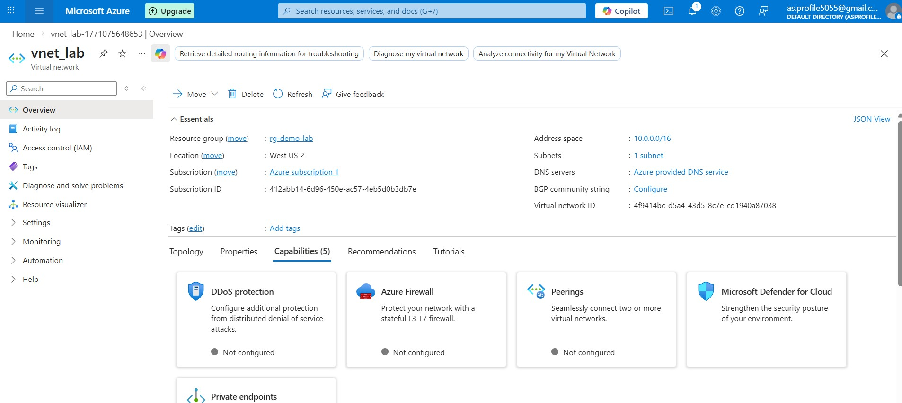
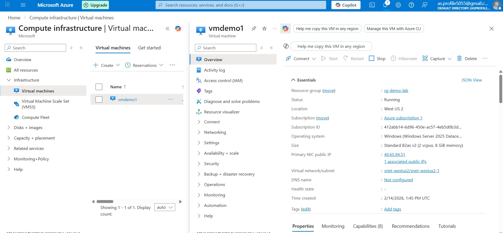
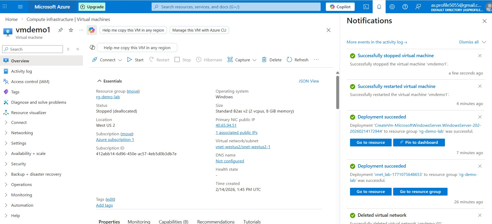

## Virtual Network (VNet)

Name: vnet_lab  
Region: West US 2  
Resource Group: rg-demo-lab  

### Description
This Virtual Network was created to host the virtual machines for testing and learning purposes.

### Configuration
- Address space: 10.0.0.0/16  
- Subnet: subnet-web (10.0.0.0/24)

### Screenshot

---

## Virtual Machine (VM)

Name: vmdemo1  
Region: West US 2  
Resource Group: rg-demo-lab  
Image: Windows Server 2025 Datacenter (x64 Gen2)  
Size: Standard B2as v2 (2 vcpus, 8 GiB memory) 

### Description
This Windows virtual machine is used for lab/testing purposes.

### Access
- Access method: RDP  
- Inbound port: 3389  
- Authentication: Username/Password  

### Screenshot (VM)

### Screenshot (VM Stopped)

### Notes
- VM is deployed inside the above VNet.
- Remember to stop/deallocate the VM when not in use to save credits.

# Azure VM & NSG 

This demonstrates the behavior of **Network Security Groups (NSGs)** when creating VMs in Azure.

---

## 1️⃣ Lab Setup

- **Virtual Network (VNet):** `vnet-lab`  
- **Subnet:** `subnet-web`  
- **VM Name:** `vmdemo1`  
- **Public IP:** Created  
- **NSG:** Initially not created manually

---

## 2️⃣ Steps Performed

1. Created VNet and Subnet manually.
2. Created VM in `subnet-web` without selecting inbound ports (to avoid auto NSG initially).  
3. Observed NSG automatically created when inbound ports (RDP) were allowed during VM creation.  
4. Checked NSG attachment:

   - NSG attached to **NIC**, not Subnet
   - Subnet had no NSG attached

5. Tested RDP connectivity:
   - Allowed by NIC NSG rules  
   - Confirmed traffic flow logic

---

## 3️⃣ Key Observations / Findings

| Action | NSG Created Automatically? | NSG Attachment |
|--------|-----------------------------|----------------|
| Create VNet | ❌ No | N/A |
| Create Subnet | ❌ No | N/A |
| Create VM with allowed inbound ports | ✅ Yes | NIC |
| Create VM with no inbound ports | ❌ No | N/A |

**Traffic Evaluation Order:**

- **Inbound:** Subnet NSG → NIC NSG → VM OS Firewall  
- **Outbound:** NIC NSG → Subnet NSG → VM OS Firewall  

---

## 4️⃣ Notes

- To control traffic for multiple VMs, attach NSG at **subnet level**.  
- Use NIC-level NSG only for VM-specific rules.  
- Always check NSG + OS firewall + public IP for troubleshooting connectivity.

---

## 5️⃣ References

- Azure NSG documentation: [https://learn.microsoft.com/azure/virtual-network/network-security-groups-overview](https://learn.microsoft.com/azure/virtual-network/network-security-groups-overview)  

# Manual RDP Connection

 1. Find vmdemo1's Public IP Copy the public IP address.

 2. Open Remote Desktop on my local machine, type mstsc, and press Enter.

 3. Paste the public IP you copied from the VM. Click Connect.

 4. Enter my VM's username and password.
Successfully connected to vmdemo1.
