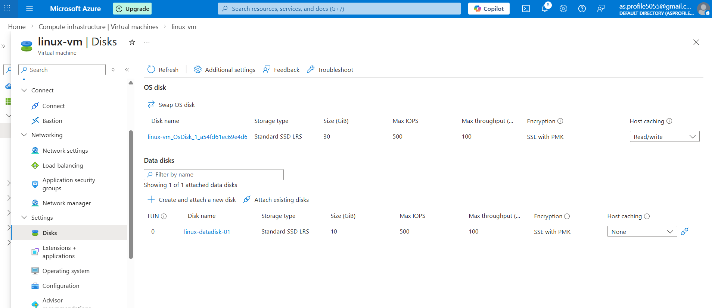

# 🔹 Azure Linux VM – Data Disk Attachment & Configuration

## 📌 Objective

To attach a new managed data disk to an existing Azure Linux Virtual Machine, configure it inside the operating system, mount it, and make the mount persistent across reboots.

---

## 🏗 Lab Environment

- VM Name: linux-vm
- OS: Ubuntu Server 22.04 LTS
- Disk Type: Azure Managed Disk (Standard SSD)
- Disk Size: 10 GiB

---

## 🟢 Step 1 – Attach Data Disk in Azure Portal

1. Navigated to Azure Portal → Virtual Machine → **Disks**
2. Selected **Create and attach a new disk**
3. Configured:
   - Disk Name: `linux-datadisk-01`
   - Size: 10 GiB
   - Host Caching: None
4. Clicked **Apply**

✔️ Disk successfully attached to VM.


---

## 🟢 Step 2 – Verify Disk in Linux

Connected to VM via SSH and ran:

```bash
lsblk
```

Output showed:

```
sdb   10G   disk
```

- `sda` → OS disk
- `sdb` → Newly attached data disk

✔️ Disk detected successfully.

---

## 🟢 Step 3 – Create Partition

Executed:

```bash
sudo fdisk /dev/sdb
```

Inside fdisk:
- n → new partition
- p → primary
- 1 → partition number
- Enter → default first sector
- Enter → default last sector
- w → write changes

Verified with:

```bash
lsblk
```

Result:

```
sdb
└─sdb1
```

✔️ Partition created successfully.

---

## 🟢 Step 4 – Format the Disk

Created ext4 filesystem:

```bash
sudo mkfs.ext4 /dev/sdb1
```

✔️ Filesystem created successfully.

---

## 🟢 Step 5 – Create Mount Directory

```bash
sudo mkdir /datadisk
```

---

## 🟢 Step 6 – Mount the Disk

```bash
sudo mount /dev/sdb1 /datadisk
```

Verified mount:

```bash
df -h
```

Output confirmed:

```
/dev/sdb1   9.8G   ...   /datadisk
```

✔️ Disk mounted successfully.

---

## ⚠️ Step 7 – Make Mount Persistent (Critical Step)

Mounting manually is temporary. To ensure persistence after reboot:

### Get UUID

```bash
sudo blkid /dev/sdb1
```

Example output:

```
UUID=e689de5e-79f7-424d-ae75-5e4cf2a7bd62
```

### Edit fstab

```bash
sudo nano /etc/fstab
```

Added the following line:

```
UUID=e689de5e-79f7-424d-ae75-5e4cf2a7bd62  /datadisk  ext4  defaults,nofail  0  2
```

### Validate configuration

```bash
sudo mount -a
```

No errors occurred.

Final verification:

```bash
df -h
```

✔️ Disk successfully configured for automatic mounting after reboot.

---

## 🎓 Key Learnings

- Azure Managed Disks must be configured inside the OS.
- New disks appear as block devices (`/dev/sdb`).
- Disk preparation steps:
  1. Partition
  2. Format
  3. Mount
  4. Persist using `/etc/fstab`
- UUID should be used instead of device names for reliability.
- Incorrect `/etc/fstab` configuration can prevent system boot.
- `mount -a` should always be tested before reboot.

---

## 🔐 Best Practices Applied

- Used UUID instead of `/dev/sdb1`
- Applied `nofail` option to prevent boot failure
- Verified configuration before reboot

---

## 🚀 Skills Demonstrated

- Azure VM storage management
- Linux disk administration
- Partition creation using fdisk
- Filesystem creation (ext4)
- Mount management
- Persistent storage configuration
- Troubleshooting and validation

