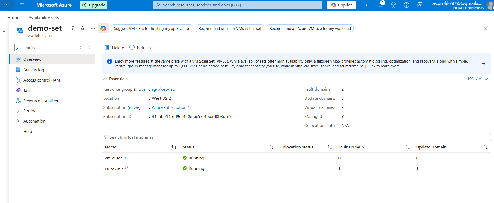

# 03 – Azure Availability Set Lab

## 📌 Objective

To configure High Availability for Azure Virtual Machines using an Availability Set and understand:

- Fault Domains
- Update Domains
- Regional vCPU quota behavior
- Marketplace image restrictions in Free subscription

---

## 🏗 Environment Details

| Setting | Value |
|----------|--------|
| Resource Group | rg-bicep-lab |
| Region | West US 2 |
| Availability Set | demo-set |
| Fault Domains | 2 |
| Update Domains | 5 |
| VM Size | Standard_D2ls_v5 (2 vCPU, 4 GB RAM) |
| Subscription Type | Azure Free Trial |

---

## 🚀 Implementation Steps

### Step 1 – Checked Regional vCPU Quota

Navigated to:

Azure Portal → Subscriptions → Usage + Quotas → Compute

Observed:
- Total Regional vCPU limit: 4
- Initially usage was 4/4

Action Taken:
- Deleted existing VMs to free up quota

Result:
- vCPU usage reduced to 0/4

---

### Step 2 – Created Availability Set

Azure Portal → Create Resource → Availability Set

Configuration:

- Name: demo-set
- Resource Group: rg-bicep-lab
- Region: West US 2
- Fault Domains: 2
- Update Domains: 5

---

### Step 3 – Created VM 1

- Name: vm-avset-01
- Image: Ubuntu Server 22.04 LTS (Canonical)
- Size: Standard_D2ls_v5
- Availability Option: Availability Set
- Selected: demo-set
- Virtual Network: Existing VNet
- Subnet: Existing subnet

---

### Step 4 – Created VM 2

- Name: vm-avset-02
- Image: Windows (Windows Server 2025 Datacenter)
- Size: Standard D2ls v5 (2 vcpus, 4 GiB memory)
- Availability Option: Availability Set
- Selected: demo-set
- Virtual Network: Existing VNet
- Subnet: Existing subnet
---

## 🔍 VM Placement Result

| VM Name | Fault Domain | Update Domain |
|----------|-------------|---------------|
| vm-avset-01 | 0 | 0 |
| vm-avset-02 | 1 | 1 |

---

## 🧠 Concepts Learned

### 🔹 Fault Domain (FD)

A Fault Domain represents a physical rack inside an Azure datacenter.

Each fault domain has:
- Separate power source
- Separate network switch
- Separate storage

If one rack fails, VMs in other fault domains continue running.

---

### 🔹 Update Domain (UD)

An Update Domain is a logical grouping used during Azure planned maintenance.

Azure updates one Update Domain at a time to prevent all VMs from restarting simultaneously.

This ensures:
- Application availability during patching
- Reduced downtime

---

## ⚠ Issues Faced & Resolution

### 1️⃣ Regional vCPU Quota Exhausted

Issue:
- No VM sizes available

Cause:
- Total Regional vCPU limit reached (4/4)

Resolution:
- Deleted old VMs to free quota

---

### 2️⃣ MarketplacePurchaseEligibilityFailed Error

Issue:
- Unable to deploy Windows image

Cause:
- Selected paid Marketplace offer
- Free subscription does not allow paid marketplace purchases

Resolution:
- Used official Microsoft / Canonical images

---

### 3️⃣ B1s Size Not Available

Cause:
- Free subscription SKU restriction in West US 2

Resolution:
- Used Standard_D2ls_v5 instead

---

## 🎯 Key Takeaways

- Availability Sets provide hardware-level high availability.
- Azure automatically distributes VMs across Fault and Update Domains.
- Regional vCPU quotas directly affect VM deployment.
- Free subscriptions restrict certain Marketplace offers and VM sizes.
- VMs inside an Availability Set can use the same VNet and Subnet without IP conflict.

---

## 📚 Interview Summary

"I deployed two virtual machines inside an Availability Set in West US 2. Azure automatically distributed them across different Fault Domains and Update Domains to ensure high availability. During deployment, I handled regional vCPU quota limitations and resolved Marketplace image eligibility issues in a Free subscription environment."

