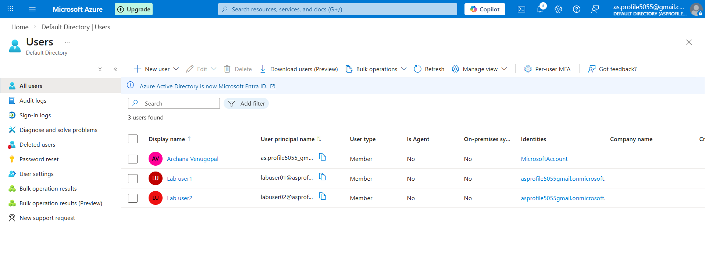
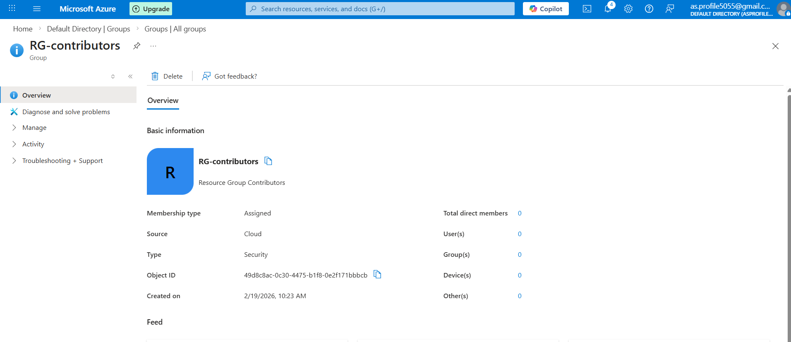
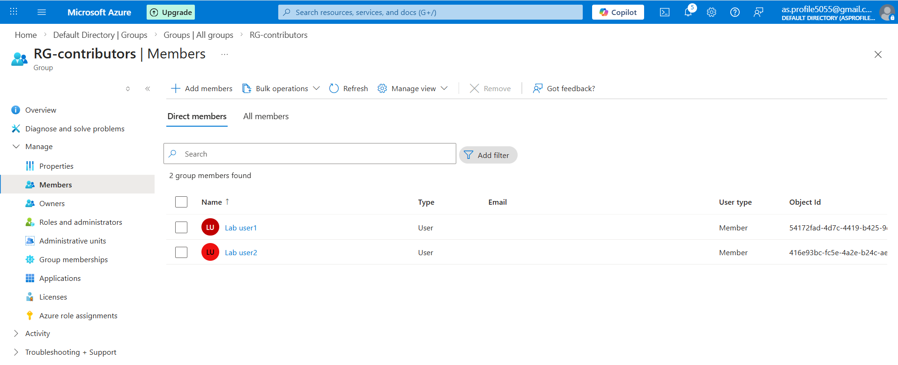
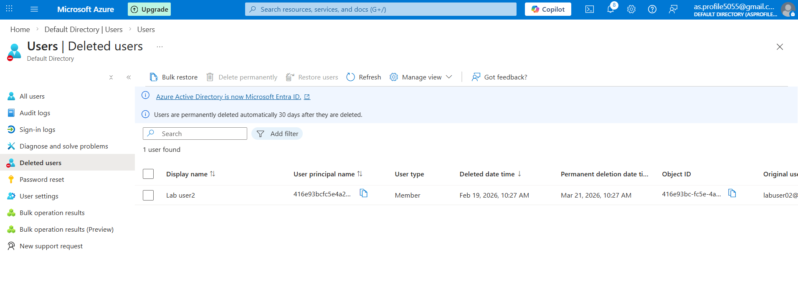
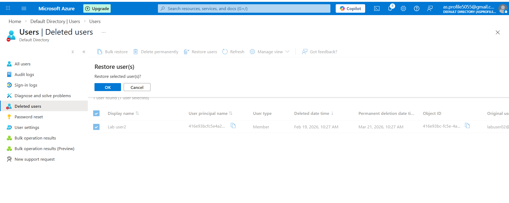

# 🔐 Microsoft Entra ID – Users & Groups Lab

## 🎯 Objective

To create and manage users and security groups in Microsoft Entra ID and understand identity management fundamentals.

---

## 🛠 Services Used

- Microsoft Entra ID
- Azure Portal

---

## 🚀 Implementation Steps

### Step 1: Created Users
- labuser1
- labuser2
- Auto-generated passwords assigned
  

### Step 2: Created Security Group
- Group Name: RG-Contributors
- Group Type: Security
- Membership Type: Assigned

### Step 3: Added Users to Group
- Added labuser1 and labuser2 as members

### Step 4: Deleted & Restored User
- Deleted labuser2

  

- Restored user from Deleted Users section

  
---

## 🧠 Key Learnings

- Users are stored in Microsoft Entra ID (Azure AD tenant)
- Security groups simplify access management
- Deleted users can be restored within 30 days

---

## 📌 Conclusion

Successfully created, managed, deleted, and restored users in Microsoft Entra ID.
