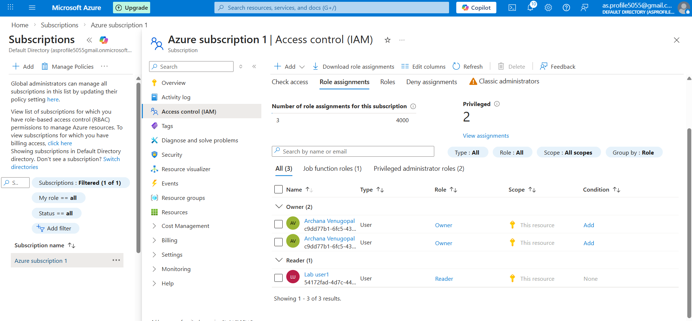
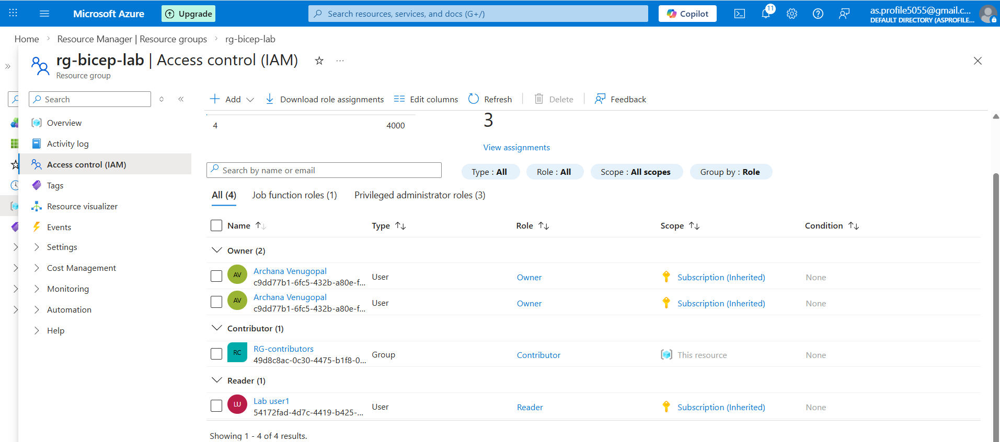

# 🔑 Azure RBAC – Role Assignment Lab

## 🎯 Objective

To assign built-in roles at different scopes and understand Role-Based Access Control (RBAC).

---

## 🛠 Services Used

- Azure Subscription
- Resource Group
- Access Control (IAM)

---

## 🚀 Implementation Steps

### Step 1: Assigned Reader Role (Subscription Level)
- Assigned Reader role to labuser1

### Step 2: Assigned Contributor Role (Resource Group Level)
- Assigned Contributor role to RG-Contributors group

---

## 🧠 Key Learnings

- RBAC controls WHO can access Azure resources
- Scope levels:
  - Management Group
  - Subscription
  - Resource Group
  - Resource
- Permissions are inherited downward

---

## 📌 Conclusion

Successfully implemented RBAC role assignments at subscription and resource group levels.
