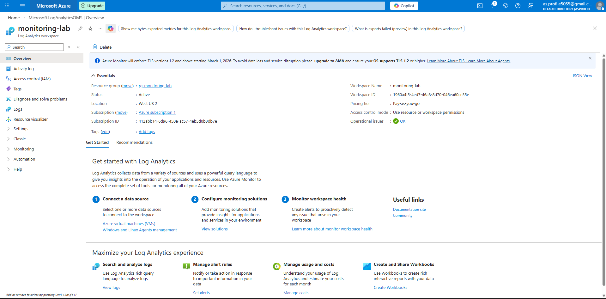
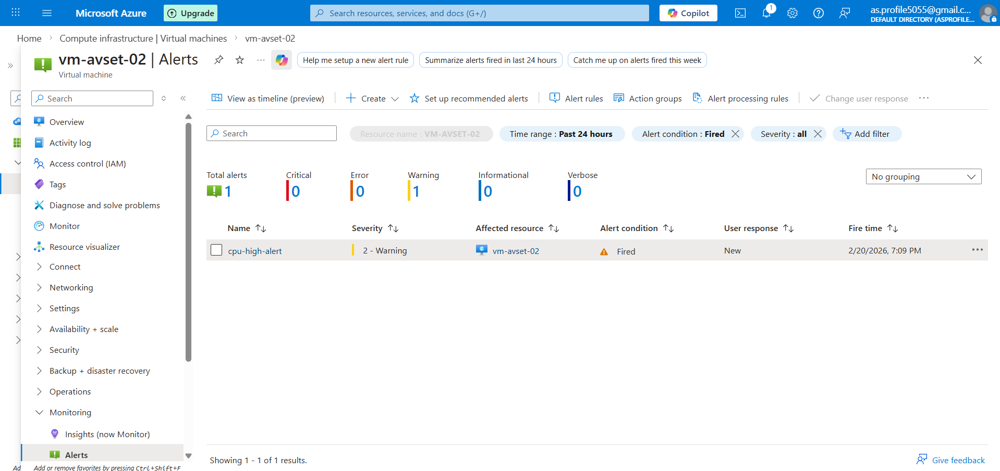
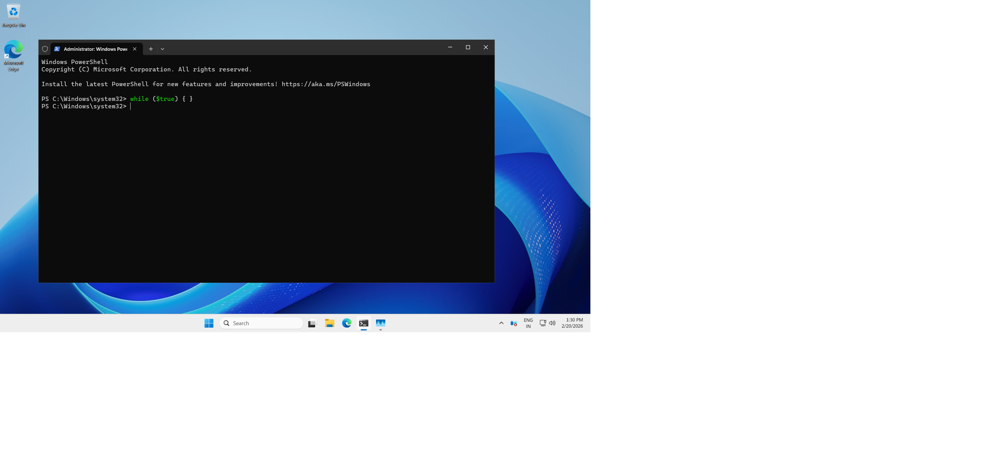
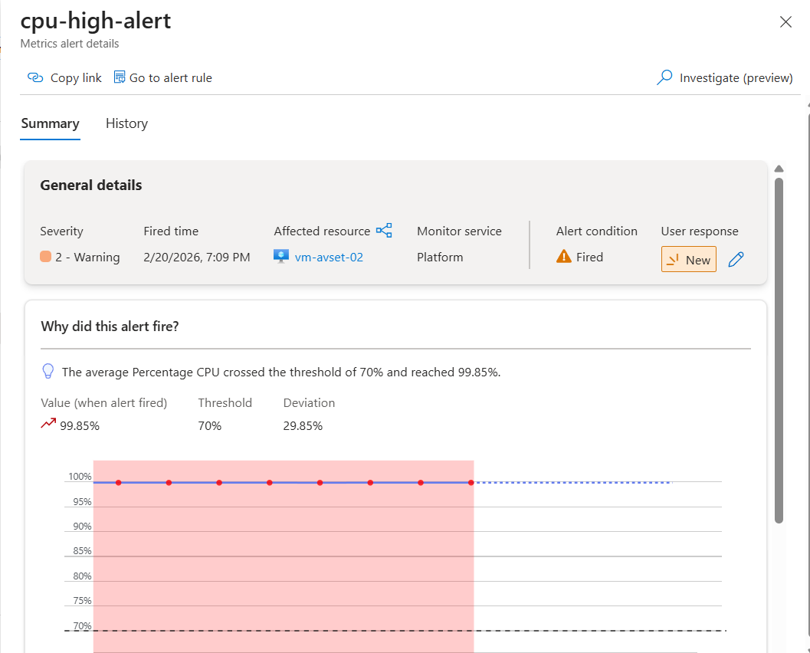
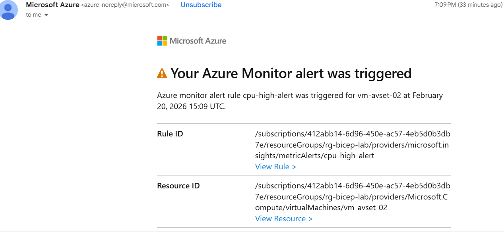

# 📊 Azure Monitoring (Azure Monitor & Alerts)

## 🎯 Objective

In this lab, I implemented monitoring for my Azure Virtual Machine using Azure Monitor.  
The goal was to:

- Collect VM performance logs
- Enable VM Insights
- Create a CPU threshold alert
- Test alert notification via email

This lab helped me understand real-world production monitoring setup.

---

# 🔹 Step 1: Create Log Analytics Workspace

## 🛠 What I Did

1. Logged into Azure Portal.
2. Searched for **Log Analytics Workspace**.
3. Clicked **Create**.
4. Selected:
   - Subscription
   - Resource Group: `rg-monitoring-lab`
5. Workspace Name: `monitoring-lab`
6. Region: `West US 2`
7. Clicked **Review + Create** → **Create**.
8. Verified deployment status as **Succeeded**.

## 🧠 What I Learned

- Log Analytics Workspace stores logs and performance data.
- It is mandatory for enabling VM Insights.
- It allows querying logs using KQL.
- It acts as the backend storage for Azure Monitor.

---

# 🔹 Step 2: Enable VM Insights (Connect VM to Azure Monitor)

## 🛠 What I Did

1. Navigated to:
   Virtual Machine → `vm-avset-02`
2. Clicked **Insights** under Monitoring section.
3. Clicked **Enable**.
4. Selected:
   - Log Analytics Workspace: `law-monitor-lab`
5. Enabled monitoring.
6. Confirmed Azure installed monitoring agent automatically.

After a few minutes, performance metrics started appearing.

## 🧠 What I Learned

- VM Insights requires Log Analytics Workspace.
- Azure installs Azure Monitor Agent automatically.
- VM Insights shows:
  - CPU usage
  - Memory usage
  - Disk performance
  - Network activity
- Monitoring provides visibility into VM health in real-time.
---

# 🔹 Step 3: Create Alert Rule (CPU > 80%)

## 🛠 What I Did

1. Navigated to:
   Azure Monitor → Alerts → Create → Alert Rule
2. Selected resource:
   - `vm-avset-02`
3. Configured Condition:
   - Signal: Percentage CPU
   - Operator: Greater than
   - Threshold: 80%
   - Aggregation: Average
   - Evaluation Period: 5 minutes
4. Created Action Group:
   - Configured email notification
5. Alert Rule Name:
   - `cpu-high-alert`
6. Clicked **Create**.

---

# 🔥 Testing the Alert

To trigger the alert:

- I generated CPU load inside the VM.

- After a few minutes, CPU usage crossed 80%.
- Alert state changed to **Fired**.

- I received email notification.

This confirmed:
- Alert rule was configured correctly.
- Action Group email works.
- Azure Monitor evaluates metrics continuously.

---

# 🧠 What I Learned from Alert Configuration

- Azure Monitor continuously evaluates metrics.
- Alert lifecycle:
  - **Fired** → When threshold is breached.
  - **Resolved** → When CPU returns to normal.
- Action Groups automate notifications.
- Monitoring is critical for production environments.
- Alerts help in proactive issue management.

---

