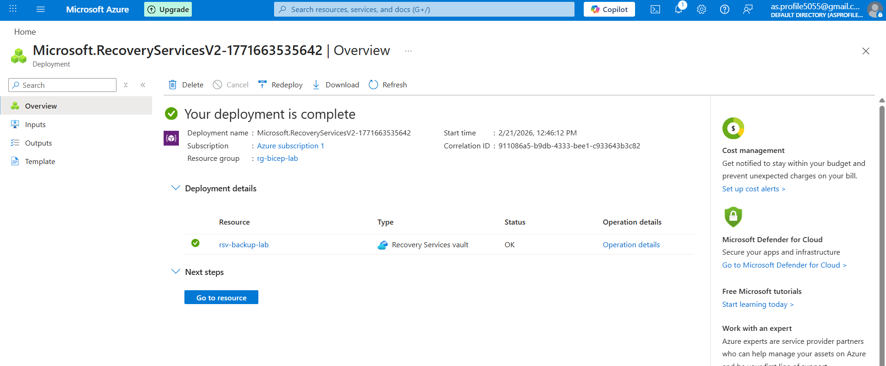
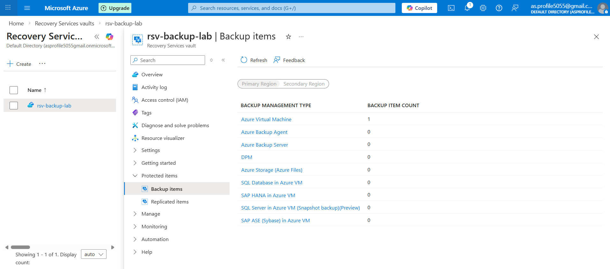
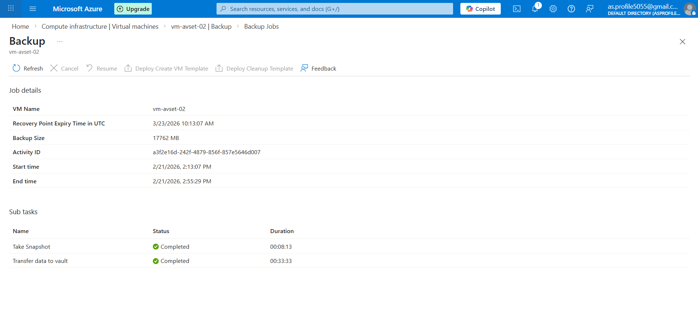
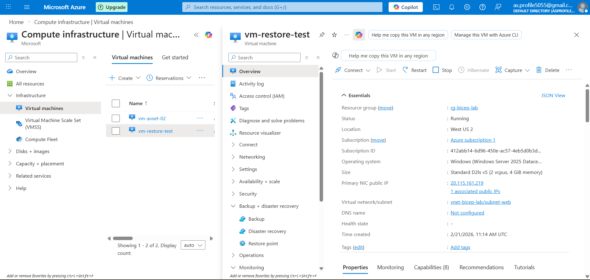

# Backup & Restore 

## 📌 Objective

Today I implemented Azure VM Backup and Restore using Recovery Services Vault.

This lab helped me understand how Azure protects virtual machines and how restore works in real-world scenarios.

---

# 🟢 Step 1 – Create Recovery Services Vault

### Steps:
1. Go to Azure Portal
2. Search for **Recovery Services Vault**
3. Click **Create**
4. Select:
   - Subscription
   - Resource Group
   - Vault Name: rsv-backup-lab
   - Region: Same as VM
5. Click Review + Create

### 🔍 What I Learned:
- Recovery Services Vault stores backup data.
- It is required before enabling VM backup.
- Vault must be in same region as VM.

  
# 🟢 Step 2 – Enable Backup for VM

### Steps:
1. Open Recovery Services Vault
2. Click **Backup**
3. Select:
   - Workload: Azure
   - Resource Type: Virtual Machine
4. Click **Backup**
5. Select the VM
6. Create/Select Backup Policy
7. Enable Backup

### 🔍 What I Learned:
- Backup does NOT create new VM.
- It creates recovery points inside vault.

# 🟢 Step 3 – Run Manual Backup

### Steps:
1. Go to Vault
2. Click Backup Items
3. Select VM
4. Click **Backup Now**
5. Choose retention date
6. Confirm

### 🔍 What I Learned:
- Manual backup creates immediate recovery point.
- Used before major changes.
- Backup jobs can be monitored under Backup Jobs.

# 🟢 Step 4 – Restore VM (Create New VM)

### Steps:
1. Go to Recovery Services Vault
2. Select Backup Item (VM)
3. Click **Restore VM**
4. Choose recovery point
5. Restore Type: Create New VM
6. Provide:
   - New VM Name: vm-restore-test
   - Resource Group
   - VNet
7. Click Restore

### 🔍 Issue Faced:
- Core quota exceeded error

### 🔧 Solution:
- Deleted unused Linux VM
- Restore succeeded

### 🔍 What I Learned:
- Restore creates new VM only when triggered.
- Backup and Restore are different processes.
- Azure checks core quota before restore.
- Restore jobs can be monitored.

# 🎯 Key Concepts I Learned Today

- What is Recovery Services Vault
- Difference between Backup and Restore
- What is Recovery Point
- Backup Policy and Retention
- Manual Backup vs Scheduled Backup
- Restore Types
- Core Quota issue troubleshooting

---
