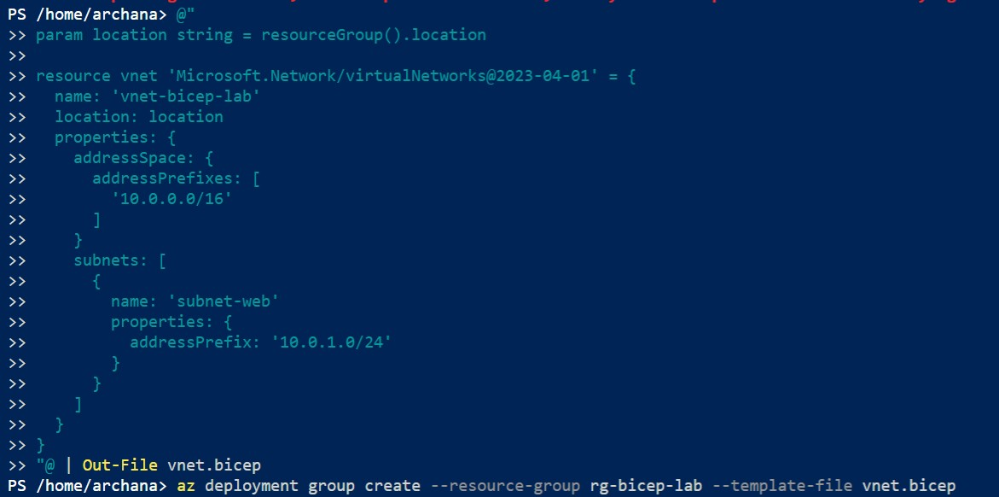
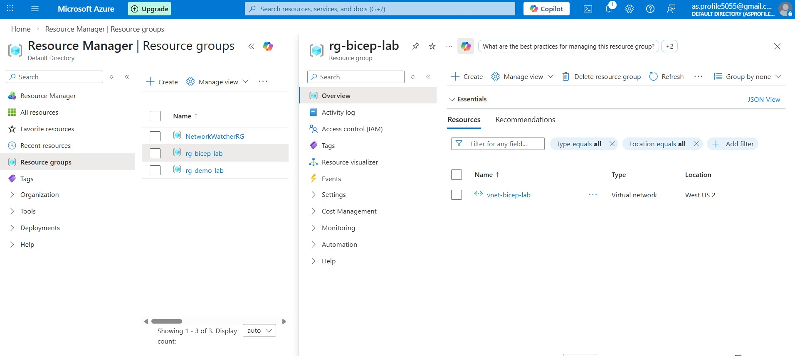

# Azure Virtual Network Deployment Using Bicep

## Lab Description

In this lab, I deployed an Azure Virtual Network (VNet) using Bicep and Azure PowerShell.

The deployment was performed using Azure Cloud Shell and validated successfully within the Azure Portal.

---

## Objective

To deploy a Virtual Network inside an existing resource group using Infrastructure as Code (IaC).

Resource Group: rg-bicep-lab  
Virtual Network Name: vnet-bicep-lab  
Address Space: 10.0.0.0/16  
Subnet Name: subnet-web  
Subnet Prefix: 10.0.1.0/24  

---

## Prerequisites

- Azure Subscription
- Existing Resource Group (rg-bicep-lab)
- Azure Cloud Shell (PowerShell)
- vnet.bicep file

## Screenshot
Bicep template used:

The output confirms the successful creation of:

- Virtual Network: vnet-bicep-lab
- Subnet: subnet-web

---

---

---

# Deployment Outcome

The Virtual Network and subnet were successfully deployed using Bicep and Azure PowerShell within the resource group `rg-bicep-lab`.

This lab demonstrates:

- Practical implementation of Infrastructure as Code (IaC)
- Azure networking fundamentals
- Resource deployment using PowerShell
- Version-controlled cloud infrastructure

---

