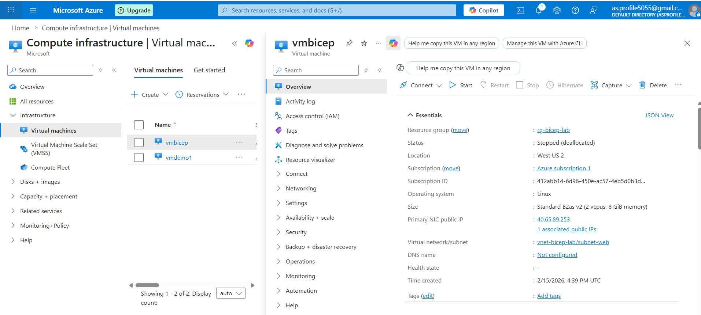

# Azure Linux VM Lab – vmbicep

This lab documents the creation of a Linux VM in Azure using **Bicep**, along with all steps, mistakes, and learnings.

---

## Lab Scenario

* Create a Linux VM using **Bicep** in West US 2.
* Resource Group: `rg-bicep-lab`
* VNet/Subnet: `vnet-bicep-lab` / `subnet-web`
* VM Name: `vmbicep`
* Admin Username: `vmbicepadmin`
* Password: `Az@vmbicepdemo2026`
* VM Size: `Standard_B2as_v2`
* Public IP: Standard SKU
* NSG to allow SSH

---

## Steps Followed

### 1. Create Bicep file (`vmbicep.bicep`)
* 

* Created VM with:

  * Ubuntu 16.04 LTS
  * Standard Public IP (avoids Basic IP limits)
  * NSG allowing SSH
  * VM size `Standard_B2as_v2`

**Key Notes / Learnings:**

* Must use **available Ubuntu SKU** in the region (`16_04-lts-gen2`)
* Use **Standard Public IP** to avoid subscription limits on Basic IPs
* VM size must exist in region — `B2as_v2` worked for this lab

---

### 2. Deploy VM using Bicep

```powershell
az deployment group create --resource-group rg-bicep-lab --template-file vmbicep.bicep
```

**Common errors encountered:**

1. **Image not found** → resolved by choosing `16_04-lts-gen2`
2. **VM size not available** → resolved by using `Standard_B2as_v2`
3. **Basic Public IP limit reached** → resolved by switching to Standard Public IP

---

### 3. Get Public IP

```powershell
az vm list-ip-addresses --name vmbicep --resource-group rg-bicep-lab --output table
```

Example output:

```
Name       PublicIpAddress   PrivateIpAddress
vmbicep    40.65.89.253     10.0.0.4
```

---

### 4. Open SSH (fix NSG if needed)

If you get `Connection closed` errors:

```powershell
az network nsg rule create --resource-group rg-bicep-lab --nsg-name vmbicep-nsg --name AllowSSH --priority 1000 --direction Inbound --access Allow --protocol Tcp --destination-port-range 22 --source-address-prefixes '*' --description "Allow SSH from anywhere"
```

> PowerShell note: **do not use `\` line continuation** — everything must be on one line or use backtick `` ` ``.

---

### 5. SSH into VM

```bash
ssh vmbicepadmin@40.65.89.253
# Password: Az@vmbicepdemo2026
```

> ⚠ Note: Password input is hidden, type carefully.

You are now logged into the Linux VM shell:

```
vmbicepadmin@vmbicep:~$
```

---

### 6. Common commands to test VM

```bash
# Check disk space
df -h

# Check network
ip a

# Update packages
sudo apt update
sudo apt upgrade -y

# Install tools
sudo apt install -y git curl
```

---

### 7. Learnings / Mistakes

* **Mistakes made:**

  * Used `< >` in SSH command → caused invalid hostname error
  * Tried Ubuntu 22.04 in West US 2 → image not available
  * Tried Basic Public IP → reached subscription limit
  * Used `\` for multi-line PowerShell → caused parser errors

* **Learnings:**

  * Always check **available VM sizes and images** per region
  * PowerShell and Bash line continuations differ (`\` vs `` ` ``)
  * Standard Public IP avoids free-tier limits
  * SSH password input is hidden by design

---
### 8. ScreenShot

### 9. Summary

* VM successfully deployed using **Bicep**
* NSG allows SSH on port 22
* Public IP accessible for remote connection
* Linux VM ready for AZ-104 labs
